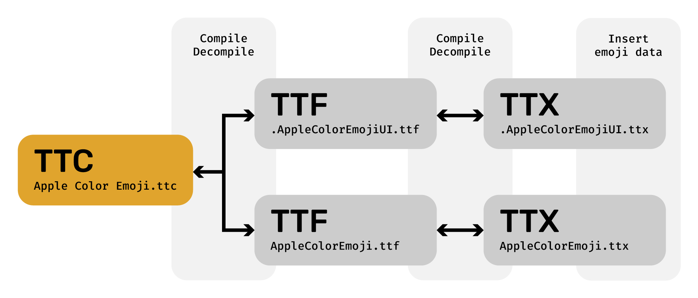

### MacMoji - Create custom emoji fonts for macOS.
---

Desite Apple's tight control over iOS and macOS, there is a way to use *any* custom emojis on Mac! :star_struck: Best part? Using a custom emoji font doesn't interfere with Apple's standard emoji font, so if you ever decide to go back to using the default emojis, you can do so with a single click.

# Table of contents
- [Table of contents](#table-of-contents)
- [Demo](#demo)
- [Installation](#installation)
  - [Dependencies](#dependencies)
  - [User installation](#user-installation)
  - [Developer installation](#developer-installation)
- [Usage](#usage)
  - [Basic usage](#basic-usage)
    - [1. Create assets](#1-create-assets)
    - [2. Generate emoji font](#2-generate-emoji-font)
    - [3. Install font](#3-install-font)
  - [Assets](#assets)
    - [Advanced names](#advanced-names)
- [How it works](#how-it-works)
  - [Generating a custom font](#generating-a-custom-font)
    - [Formats](#formats)
    - [TTX format](#ttx-format)
    - [Recompiling](#recompiling)
- [Limitations](#limitations)
  - [Workaround](#workaround)

# Demo

Coming soon:tm:

# Installation

## Dependencies

This project has 3 main dependencies, all **required for MacMoji to work** :gear:

- [`cairo`](https://formulae.brew.sh/formula/cairo)
- [`libffi`](https://formulae.brew.sh/formula/libffi)

All can be installed via [Homebrew](https://brew.sh):
```bash
brew install cairo libffi git-lfs
```

## User installation

Once you have installed all [dependencies](#dependencies), simply pip-install! :star_struck:

```bash
pip install macmoji
```

You should also verify the installation by running `macmoji --version` and making sure a version number is printed. Check out [Usage](#usage) for more info on how to actually use MacMoji!

## Developer installation

If you want to customize or contribute to MacMoji, here's the dev installation :technologist: Make sure you have the required [dependencies](#dependencies) installed before getting started!

You will also need to have Poetry installed. Install instructions [here](`https://python-poetry.org/docs/#installation`) :pushpin:

```bash
# git clone and cd into repo
git clone
cd macmoji

# Install dependencies
poetry install

# Enter the poetry shell
poetry shell
```

When running macmoji, use `python -m macmoji` instead of just `macmoji` with all commands, to ensure that Python uses the development version of MacMoji that you just set up!

# Usage

## Basic usage

To make your own first emoji font, you only need 3 commands!

### 1. Create assets

This creates all the required versions of the assets needed for generating the font. By default, MacMoji takes care of the outputs so you don't have to mind the output location. Read more about what assets should be in `<assets_dir>` [here](#assets).

```bash
macmoji create assets <assets_dir>
```

### 2. Generate emoji font

This generates the emoji font that'll soon be used by your Mac. Unless you touched the output location when generating the assets, MacMoji will find your generated assets for you!

```bash
macmoji create font
```

### 3. Install font

Moves the generated emoji font file to the right location, which activates it right away! If you ever want to disable it, just run `macmoji uninstall`.

```bash
macmoji install
```

That's it! You've now created and activated your own custom emoji font on Mac :partying_face: :tada:

## Assets

For every emoji you want to replace with your own version, you'll need either an `.svg` or high-res `.png` file. This should be named with the exact unicode value of the emoji. For most emojis, you can copy-paste the relevant codepoint from a website like [emojipedia.org](https://emojipedia.org/). Here's an example of a valid assets folder:

```
~/emoji-assets/
├── 1F528.svg        # Hammer
├── 1F600.svg        # Grinning face
├── 1F60D.png        # Heart-eyes
├── 1F636_1F32B.svg  # Face in clouds
└── 1F635_1F4AB.png  # Face with spiral eyes
```

In the example above, the final assets would ge generated by running:
```bash
macmoji create assets ~/emoji-assets
```

### Advanced names

For most emojis, the information above will be enough. However, some emojis have modifiers for gender, skin color, etc. These are named in a very specific way.

The general format is: `XXXXX.0-6.MWBGLR`, with the following meanings:
- `XXXXX`: Unicode codepoint of the base emoji, ignoring leading zeroes. Codepoint don't need to include leading zeroes
- `0-6`: Skintone modifiers. Only 0-5 (going from lightest to darkest) are used in most emojis (see note about 6 below). Multiple can ve used at once in some emojis
- `MWBG`: Gender modifiers. M=Male, F=Female, B=Boy, G=Girl, L=Left, R=Right. Multiple can be used at once in some emojis

Examples of valid file names (of course, either `.svg` or `.png` are fine) and what emoji they represent:
- `1F385.2.svg`: Santa Claus, Medium-Light Skin Tone
- `1F3C3.0.M.svg`: Man Running Facing Right, No Skin Tone
- `1F469_1F91D_1F468.55.svg`: Woman and Man Holding Hands: Dark Skin Tone

Note: for `u1F9D1_u1F91D_u1F9D1.XX`, X is 1-6 instead of 0-5, where the meaning of 6 is the same as 0 in the rest of the formats. From my observations, these are the only emojis with 6 modifiers.

# How it works

The macOS font for emojis is called `Apple Color Emoji.ttc`. In order to change how emoji look, we need to create our own version of this font that takes priority over the default system font. Luckily for us, apps will prioritize user-installed fonts over system-wide ones, so there's a simple way to do this! :muscle:

- `/System/Library/Fonts/Apple Color Emoji.ttc` - system font
- `~/Library/Fonts/Apple Color Emoji.ttc` - our custom font :heart_eyes:

## Generating a custom font

In broad terms, the custom emoji font file is generatad by taking Apple's base emojis, decompiling the font files, inserting your assets in the right sizes and formats, and recompiling. Here's a diagram to illustrate the process, before we dig deeper :nerd_face:




### Formats

These are terms you might see a lot when using MacMoji. In essence, this is what the file types are for:

- **`TTC`** (TrueType Collection): a collection of multiple TTF files, combined into a single file
- **`TTF`** (TrueType Font): all the data used for a single font
- **`TTX`**: a decompiled version of a TTF file

So far so easy, but we now enter the world of *font files*  and the `TrueType` specification :face_with_spiral_eyes: Apple uses a special table in the TrueType files called `SBIX` for storing the actual image data for the emoji fonts. This table contains a bunch of `strikes`, each of which containing all the assets for an emoji at that exact size.

During the decompilation stage, MacMoji splits the TTC file into the TTF files that it contains, in this case the two following files:
- `AppleColorEmoji.ttf`
- `.AppleColorEmojiUI.ttf`

The TTF files are very, very similar, so for this project they'll basically be treated as the same. The TTF files are then decompiled into TTX files with the same names (except extension, of course).

### TTX format

The TTX file is where MacMoji does most of the actual emoji replacement. In the code snippet below, you can see an example of how a `SBIX` table might look in a TTX file. The relevant portion for this project is the `<strike>` tag, which contains all the assets (and data) needed for displaying all emojis at a given size. In the snippet, `<ppem value="20" />` tells us that the size of the emojis at that strike is `20px`.

The data for every individual emoji is under a `<glyph>` tag per emoji. The `name` attribute signals what emoji is being referred to, while the `<hexdata>` tag inside is filled with the hexadecimal representation of the data from a PNG file at the given size, for that emoji. MacMoji automatically inserts the new emoji assets at all the relevant places in the TTX files.

```xml
<sbix>
  <version value="1"/>
  <flags value="00000000 00000001"/>
  <strike>
    <ppem value="20"/>
    <resolution value="72"/>
    <glyph name=".notdef"/>
    ...
    <glyph graphicType="png " name="u0023_u20E3" originOffsetX="0" originOffsetY="0">
        <hexdata>
        ...
        </hexdata>
    </glyph>
    ...
  </strike>
  ...
</sbix>
```

### Recompiling

Recompiling the modified TTX files into TTF and then a single TTC file is basically the same process as splitting them up, but in reverse :exploding_head:


# Limitations

If you use the default way of installing your custom font (`macmoji install`), the emojis will update basically everywhere. However, a few notable exceptions are:
- **WebKit**: affects Safari (but not other browsers like Chrome and Firefix, since they're using a different rendering engine than WebKit)
- **Some Adobe apps**: affects Illustrator, Photoshop and (while selecting text) XD. Other adobe apps have not been tested

## Workaround

By default, MacMoji installs the custom emoji font to `~/Library/Fonts/Apple Color Emoji.ttc`, which only affects the user's emoji configuration (see [#how-it-works](#how-it-works)). However, from reading WebKit's source code I'm under the impression that WebKit links directly to Apple's source emoji font file at `/System/Library/Fonts/Apple Color Emoji.ttc`, and it's possible that Adobe is doing something similar in the older apps.

By *replacing* the system emoji font, you should be able to get WebKit to use the correct emoji font. However, this requires some [changes to the system files](https://discussions.apple.com/thread/7411553) that you should **not** attempt if you don't know what you're doing. I have not yet tested this, and can't confirm that it works, but if some brave soul wants to help out, I'd love to hear how it goes!